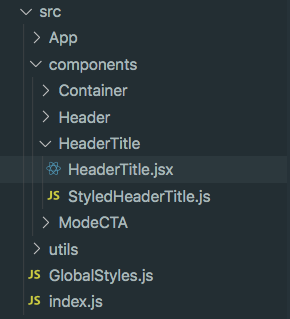
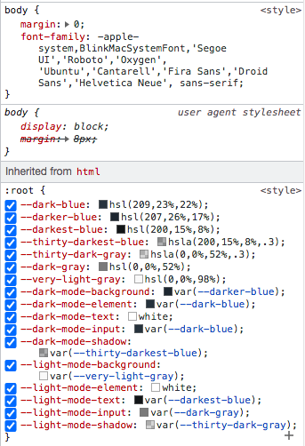

# Dark mode usando Styled-components

## Table of contents

- [Objetivo general](#objetivo-general)
- [Introducción a Styled-components](#introducción-a-styled-components)
  - [Ventajas de usar Styled-components](ventajas-de-usar-styled-components)
  - [Desventajas de usar Styled-components](#desventajas-de-usar-styled-components)
- [Instalación y algunos ejemplos](#instalación-y-algunos-ejemplos)
  - [Instalación](#instalación)
  - [Crear un componente](#crear-un-componente)
  - [Crear estilos globales](#crear-estilos-globales)
  - [Proveer los themes a toda la App](#proveer-los-themes-a-toda-la-App)
- [Como usar este repositorio](#como-usar-este-repositorio)

## Objetivo general

Implementar la funcionalidad de Dark Mode usando Styled-components en React.

## Introducción a Styled-components

Styled-components es la repuesta a la búsqueda de como podemos ensanchar CSS para darle estilos a el sistema de componentes de React.

### Ventajas de usar Styled-components

* Automatic critical CSS: Styled-components mantiene un rastreo de cuales componentes son renderezados en la pagina y le inyecta sus estilos y nada mas de manera autmatica.

* No mas Bugs por nombres de class: Styled-components genera  nombres de clase únicos para los estilos. Nunca mas te preocuparas por duplicación, superposición o errores de escritura. 

* Facil de remover del CSS: es difícil saber donde se uso un nombre de clase fue usado dentro del código. Styled-components makes esto obvio, como cada pedazo de CSS es atado a un componente especifico. 

* Simple dynamic styling: Adaptar los estilos del componente basado en las props o el thema global es simple e intuitivo sin la necesidad de manejar muchas clases.

* Mantenimiento menos doloroso: No tendrás que buscar a través que line a código esta afectando  el component.

* Automatic vendor prefixing: Escribe tu CSS normal y permite que Styled-components haga el resto.

Tienes todos estos beneficios mientras escribes CSS de toda la vida, solo separado en piezas individuales.

### Desventajas de usar Styled-components

En mi concepto. Si tienes muchos componentes similares como muchos componentes botón cuando estas en el navegador buscando cual es. Los hash generados en las clases no generan ninguna información extra para saber cual es el componente especifico.

## Instalación y algunos ejemplos

### Instalación

Instalar styled-components solo toma una linea de código :

```bash
# with npm
npm install --save styled-components

# with yarn
yarn add styled-components
```

### Crear un componente

Estructura de carpetas



Crear estilos StyledHeaderTitle.js

```javaScript
  import styled from 'styled-components';

  const StyledHeaderTitle = styled.h2`
    margin: 0;
    font-size: 14px;
    font-weight: 800;
  `
  export default StyledHeaderTitle;
```

Crear el componente de React HeaderTitle.jsx

```javaScript
import StyledHeaderTitle from './StyledHeaderTitle';

const HeaderTitle = () => {
  return (
    <StyledHeaderTitle>
      Dark Mode Example
    </StyledHeaderTitle>
  )
}

export default HeaderTitle;
```
Como se ve en el navegador


### Crear estilos globales

Crear los estilos globales en GlobalStyles.js

```javaScript
import { createGlobalStyle } from "styled-components";

const GlobalStyles = createGlobalStyle`
:root {
  --dark-blue: hsl(209, 23%, 22%);
  --darker-blue: hsl(207, 26%, 17%);
  --darkest-blue: hsl(200, 15%, 8%);
  --thirty-darkest-blue: hsla(200, 15%, 8%, .3);
  --thirty-dark-gray: hsla(0, 0%, 52%, .3);
  --dark-gray: hsl(0, 0%, 52%);
  --very-light-gray: hsl(0, 0%, 98%);
  
  --dark-mode-background: var(--darker-blue);
  --dark-mode-element: var(--dark-blue);
  --dark-mode-text: white;
  --dark-mode-input: var(--dark-blue);
  --dark-mode-shadow: var(--thirty-darkest-blue);
  
  --light-mode-background: var(--very-light-gray);
  --light-mode-element: white;
  --light-mode-text: var(--darkest-blue);
  --light-mode-input: var(--dark-gray);
  --light-mode-shadow: var(--thirty-dark-gray);
}

body {
  margin: 0;
  font-family: -apple-system, BlinkMacSystemFont, 'Segoe UI', 'Roboto', 'Oxygen',
    'Ubuntu', 'Cantarell', 'Fira Sans', 'Droid Sans', 'Helvetica Neue',
    sans-serif;
}
`

export default GlobalStyles;
```

Como se ve en el navegador.



### Proveer los themes a toda la App
 
Crear los themes en la App ./src/utils/themes.js

```javaScript
export const lightTheme = {
  backgroundBody: '--light-mode-background',
  text: '--light-mode-text',
  backgroundElement: '--light-mode-element',
  input: '--light-mode-input',
  shadow: '--light-mode-shadow'
}

export const darkTheme = {
  backgroundBody: '--dark-mode-background',
  text: '--dark-mode-text',
  backgroundElement: '--dark-mode-element',
  input: '--dark-mode-input',
  shadow: '--dark-mode-shadow'
}
```
Proveer themes a la App

```javaScript
import { useState } from 'react';
import StyledApp from './StyledApp';
import Container from '../components/Container/Container';
import Header from '../components/Header/Header';
import { ThemeProvider } from 'styled-components';
import { darkTheme, lightTheme } from '../utils/themes';

function App() {

  const [theme, setTheme] = useState('dark');

  const toggleTheme = () => {
    if (theme === 'dark') {
      setTheme('light');
    } else {
      setTheme('dark');
    }
  }

  return (
    <ThemeProvider theme={theme === 'dark' ? darkTheme : lightTheme}>
      <StyledApp>
        <Container>
          <Header toggleTheme={toggleTheme} theme={theme}/>
        </Container>
      </StyledApp>
    </ThemeProvider>
  );
}

export default App;
```
Aplicandolo en el componente

```javaScript
.App {
  border: 1px solid purple;

  height: 100vh;
  width: 100vw;
  box-sizing: border-box;

  display: grid;
  justify-content: center;
  align-content: center;

  background-color: var(--dark-mode-background);
}
```

## Como usar este repositorio

Este repo tiene 6 ramas y en cada se realiza un paso para lograr implementar la funcionalidad de Dark Mode.

* master
* 01-install-styled-components
* 02-convert-all-components-to-styled-components
* 03-create-global-styles
* 04-create-and-provide-themes
* 05-apply-themes-to-components
* 06-manage-mode-with-button

Master es la rama inicial y puedes pasar de rama a rama y ver cada paso en la implementación. en la rama 06-manage-mode-with-button puedes ver la implementación terminada.
